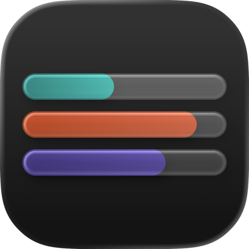

<p align="center">
  
</p>

<h1 align="center">UsageTracker</h1>

<p align="center">
  Keep an eye on your AI coding tools — usage, limits, resets, and cost, right from your menu bar.
</p>

<div align="center">
  <a href="docs/index.md">Documentation</a>
  <span>&nbsp;&nbsp;•&nbsp;&nbsp;</span>
  <a href="#providers">Providers</a>
  <span>&nbsp;&nbsp;•&nbsp;&nbsp;</span>
  <a href="#get-started">Get started</a>
  <span>&nbsp;&nbsp;•&nbsp;&nbsp;</span>
  <a href="docs/cli.md">CLI</a>
</div>

### [Read the docs →](docs/index.md)

## What is UsageTracker?

UsageTracker is a macOS menu bar app that shows how much of your AI coding tools you've used — and how much you have left. It watches the tools you already use, keeps a tidy history on your Mac, and shows it all in one place.

It runs as three pieces that work together: a **menu bar app**, a lightweight **background daemon** that does the collecting, and a **terminal CLI** for when you'd rather stay in the shell.

```sh
usage                 # show your usage dashboard
```

Everything stays on your machine. There's no account to create and no server to phone home to. UsageTracker never asks for your provider passwords, and it doesn't keep the raw responses it gets back from providers.

## What it shows

- Session, weekly, monthly, and credit limits — however each provider slices things up.
- When your limits reset, how much you have left, and where you're headed.
- Account-wide activity, when a provider shares it.
- Local token usage and estimated cost, for when a provider doesn't hand you a bill.
- Multiple Codex, Claude, and Grok accounts, each kept neatly separate.
- Whether a provider is healthy, rate-limited, or having trouble signing in.
- A desktop heads-up before you run out of a quota that matters.

## Providers

| Provider | What it reads | Multiple accounts? | On by default? |
| --- | --- | --- | --- |
| [Codex](docs/codex.md) | The Codex app-server, falling back to ChatGPT usage and local estimates | Yes | Yes |
| [Claude](docs/claude.md) | Anthropic's usage API, falling back to the Claude CLI and local estimates | Yes | No |
| [OpenCode Go](docs/opencode.md) | The OpenCode web console, falling back to a local database | One workspace | No |
| [Grok](docs/grok.md) | Grok's billing service, falling back to grok.com | Yes | No |

UsageTracker uses the credentials you've already set up — Keychain items, config files, or a browser session — so you rarely have to do anything special. Each provider works a little differently; the pages linked above have the full story.

## Get started

On a Mac running macOS 14 or newer, install the app and CLI from the latest release:

```sh
curl --proto '=https' --tlsv1.2 -fsSL \
  https://github.com/joeymalvinni/usagetracker/releases/latest/download/install.sh | bash
```

The installer verifies published SHA-256 checksums, archive contents, and ad-hoc code-signature integrity, puts the app in `~/Applications`, and installs the `usage` command in `~/.local/bin`. When a newer stable release is available, the dashboard shows an **Update** button that uses the same verified installer to replace and relaunch the app in place. Releases are **not notarized by Apple**, so macOS may require [manual approval](docs/troubleshooting.md#opening-the-unnotarized-app) the first time the app opens. The installer never removes your `~/.usagetracker` data during an install or upgrade. Pass options after `bash -s --`; for example, use `--cli-only`, `--app-only`, `--no-launch`, or `--version v0.1.0`.

On first launch, pick the tools you use and follow the sign-in steps for each. You can always change this later under **Settings → Connections**.

To uninstall the app and CLI while keeping your local data:

```sh
curl --proto '=https' --tlsv1.2 -fsSL \
  https://github.com/joeymalvinni/usagetracker/releases/latest/download/uninstall.sh | bash
```

### Build from source

You'll need [Rust](https://www.rust-lang.org/), Xcode, and [`just`](https://just.systems/):

```sh
git clone https://github.com/joeymalvinni/usagetracker.git
cd usagetracker
just app
```

That builds the app (daemon included) and opens it.

Prefer to stay in the terminal? Run the daemon in one window and talk to it from another:

```sh
cargo run -p usage-daemon        # start the daemon
cargo run -p usage-cli -- status # check in from another terminal
```

The daemon sets up its config, database, and socket on its own.

## Learn more

- [Documentation](docs/index.md) — the full guide.
- [CLI reference](docs/cli.md) — every command and flag.
- [Configuration](docs/configuration.md) — settings, files, and overrides.
- [Troubleshooting](docs/troubleshooting.md) — when something isn't working.
- [Security](docs/security.md) and [data & privacy](docs/data-and-privacy.md) — what's stored and who can see it.
- [Socket API](docs/api/index.md) — the protocol behind the app and CLI.
- [Changelog](CHANGELOG.md) — what's new.

## License

[MIT](LICENSE) © 2026 Joey Malvinni and UsageTracker contributors.
