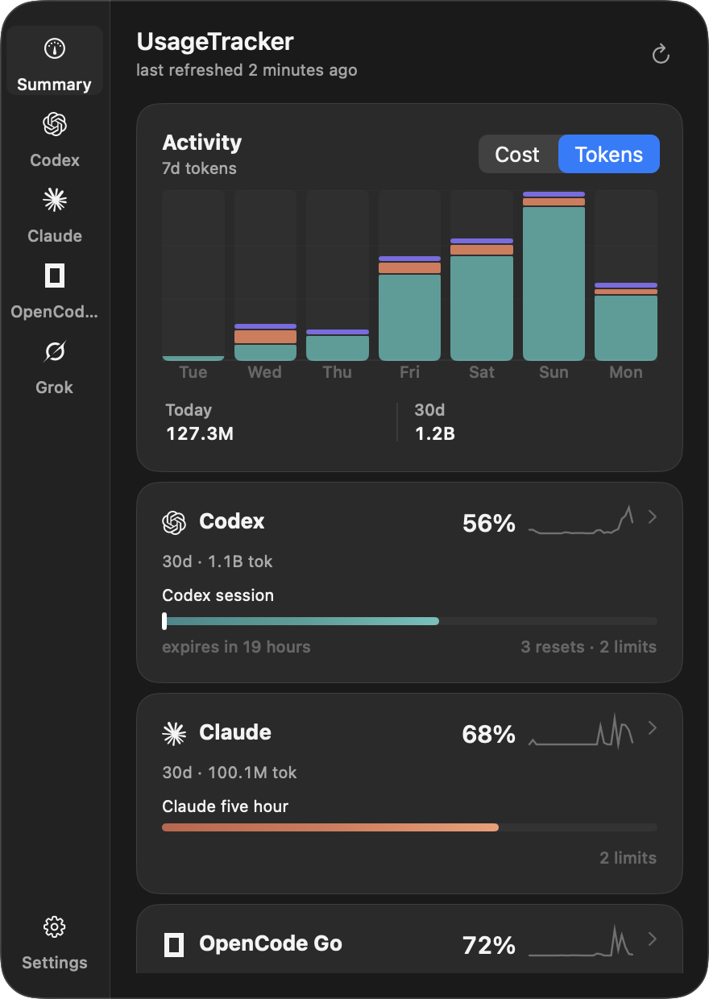
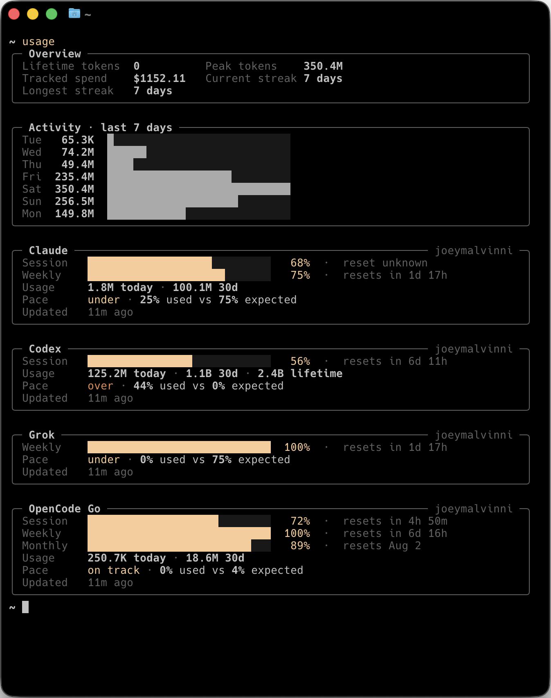

<p align="center">
  
</p>

<h1 align="center">UsageTracker</h1>

<p align="center">
  Keep an eye on your AI coding tools — usage, limits, resets, and cost, right from your menu bar.
</p>

<p align="center">
  <a href="#install">Install</a>
  <span>&nbsp;&nbsp;•&nbsp;&nbsp;</span>
  <a href="#providers">Providers</a>
  <span>&nbsp;&nbsp;•&nbsp;&nbsp;</span>
  <a href="docs/index.md">Documentation</a>
  <span>&nbsp;&nbsp;•&nbsp;&nbsp;</span>
  <a href="docs/cli.md">CLI</a>
</p>

<p align="center">
  
  <span>&nbsp;&nbsp;</span>
  
</p>

## What UsageTracker tracks

- Multiple Codex, Claude, and Grok accounts, with separate profiles and history
- Remaining usage and reset times for each available limit
- Pace forecasts based on usage and time elapsed
- Notifications for thresholds, projected exhaustion, and resets
- Local token activity, estimated cost, and provider health

The same data is available from the macOS menu bar app and the `usage` CLI.

# Install

The UsageTracker menu bar app requires macOS 14 or newer. Install the app and CLI from the latest release:

```sh
curl --proto '=https' --tlsv1.2 -fsSL \
  https://github.com/joeymalvinni/usagetracker/releases/latest/download/install.sh | bash
```

The installer verifies the published checksums and installs `UsageTracker.app` in `~/Applications` and `usage` in `~/.local/bin`.

Open the app, choose **Find my accounts**, and UsageTracker will look for accounts already signed in on your Mac. You can add and manage more accounts later in Settings.

```sh
$ usage
```

Releases are not currently notarized by Apple, so macOS may ask you to approve the app the first time it opens. Follow the [first-launch instructions](docs/troubleshooting.md#opening-the-unnotarized-app) rather than disabling Gatekeeper.


## Providers

| Provider | What UsageTracker collects | Accounts |
| --- | --- | --- |
| [Codex](docs/codex.md) | Rate limits, reset credits, account activity, and local token cost | Multiple |
| [Claude](docs/claude.md) | Usage limits, extra usage, and local token cost | Multiple |
| [OpenCode Go](docs/opencode.md) | Rolling, weekly, and monthly usage, history, and balance | One workspace |
| [Grok](docs/grok.md) | Included and on-demand usage from Grok Build or grok.com | Multiple |

Each provider exposes different data, so UsageTracker reports the best available source without presenting local estimates as provider-reported quota.

## Local by design

UsageTracker has no hosted backend. A local daemon talks directly to the providers you enable, stores normalized history in SQLite, and serves the menu bar app and CLI over a Unix socket. After onboarding, macOS runs it as a per-user LaunchAgent so collection and the CLI continue working when the menu app is closed.

It uses credentials already available in Keychain, provider config files, or supported browser sessions. Raw provider responses are parsed in memory and are not stored. See [Security](docs/security.md) and [Data and privacy](docs/data-and-privacy.md) for the full trust model.

## Build from source

You'll need [Rust](https://www.rust-lang.org/), Xcode, and [`just`](https://just.systems/):

```sh
git clone https://github.com/joeymalvinni/usagetracker.git
cd usagetracker
just app
```

That builds the app with the daemon included and opens it.

To work entirely from the terminal, run the daemon in one window and the CLI in another:

```sh
cargo run -p usage-daemon
cargo run -p usage-cli -- status
```

### Nix

The flake packages the daemon and CLI on macOS and Linux. Start the daemon in one terminal, then query it from another:

```sh
nix run .#daemon
nix run .#cli -- status
```

`nix develop` opens a development shell with Rust, Clippy, rustfmt, and `just`. On macOS, the Swift menu bar app still requires Xcode and can be built from that shell with `just app`; Linux supports the daemon and CLI only.

## Documentation

- [Getting around the project](docs/index.md)
- [CLI reference](docs/cli.md)
- [Configuration](docs/configuration.md)
- [Multiple accounts](docs/multi-account.md)
- [Troubleshooting](docs/troubleshooting.md)
- [Socket API](docs/api/index.md)
- [Changelog](CHANGELOG.md)

## Uninstall

Remove the app and CLI while keeping your local UsageTracker data:

```sh
curl --proto '=https' --tlsv1.2 -fsSL \
  https://github.com/joeymalvinni/usagetracker/releases/latest/download/uninstall.sh | bash
```

## License

[MIT](LICENSE) © 2026 Joey Malvinni and UsageTracker contributors.
